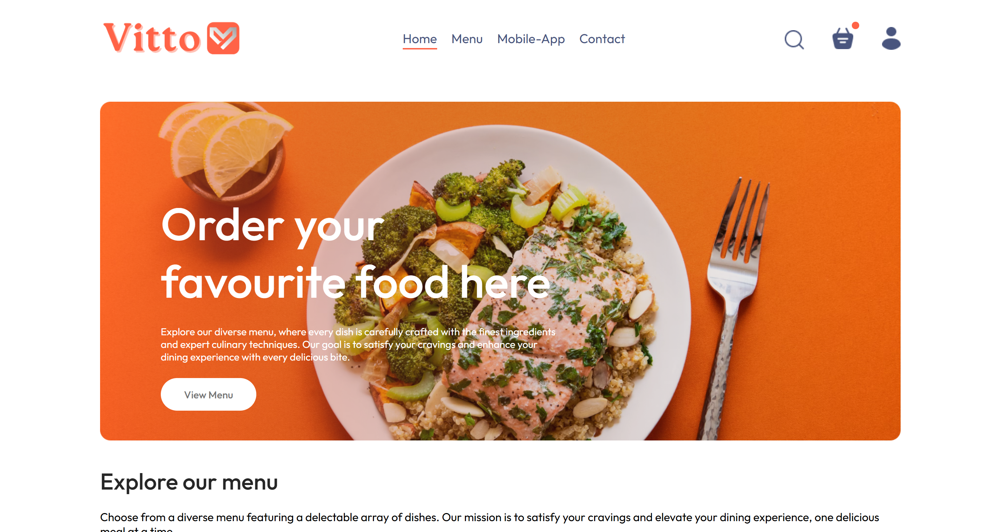
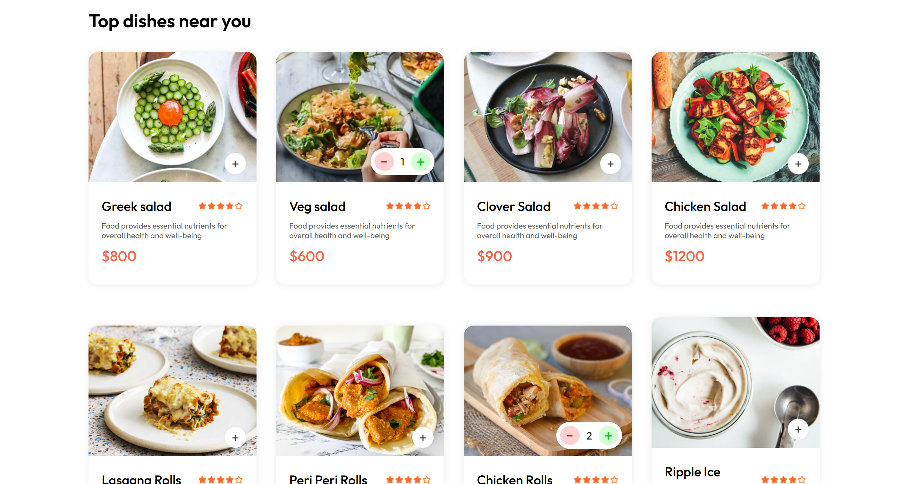
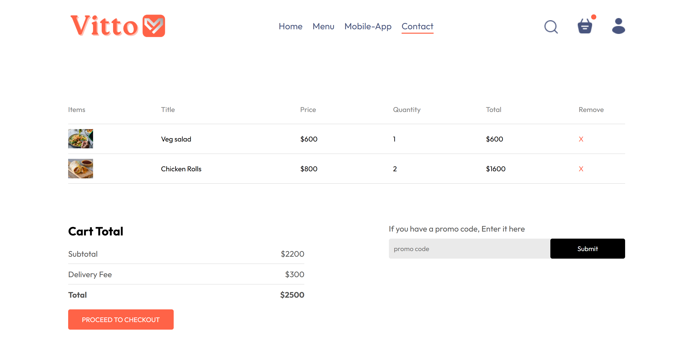
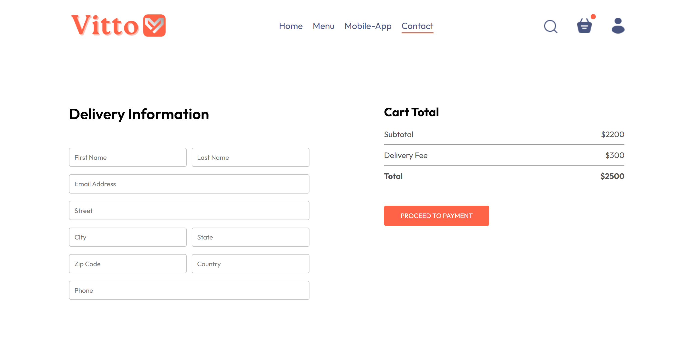
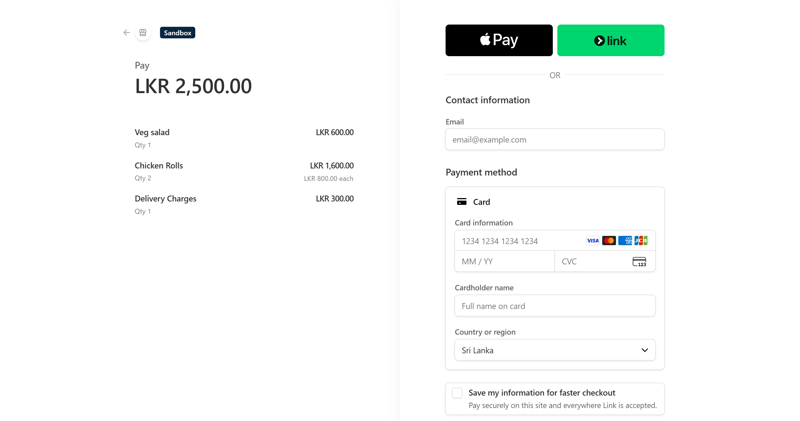
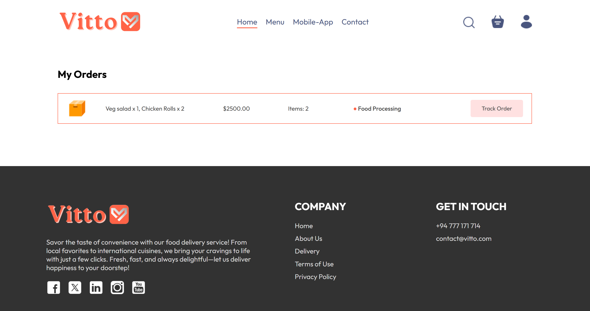
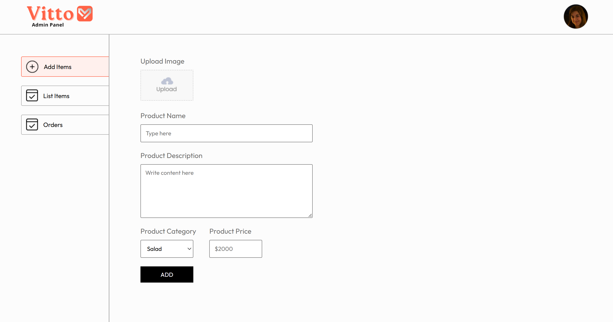
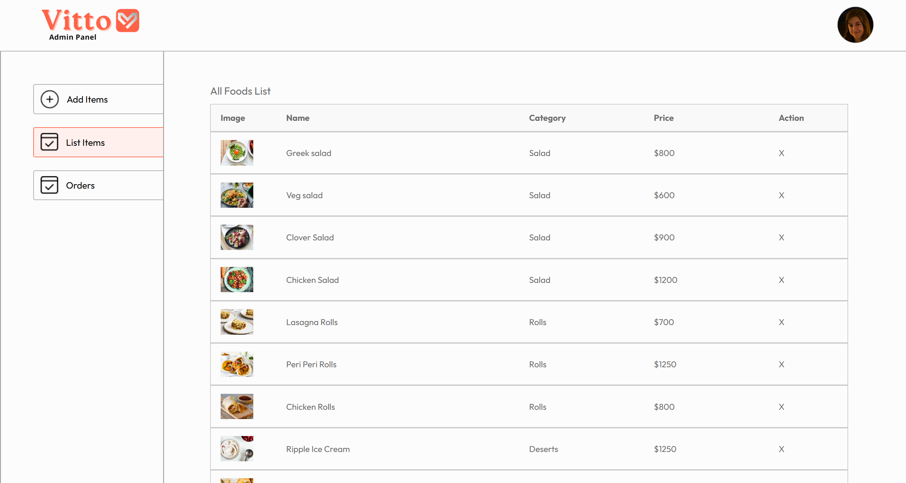
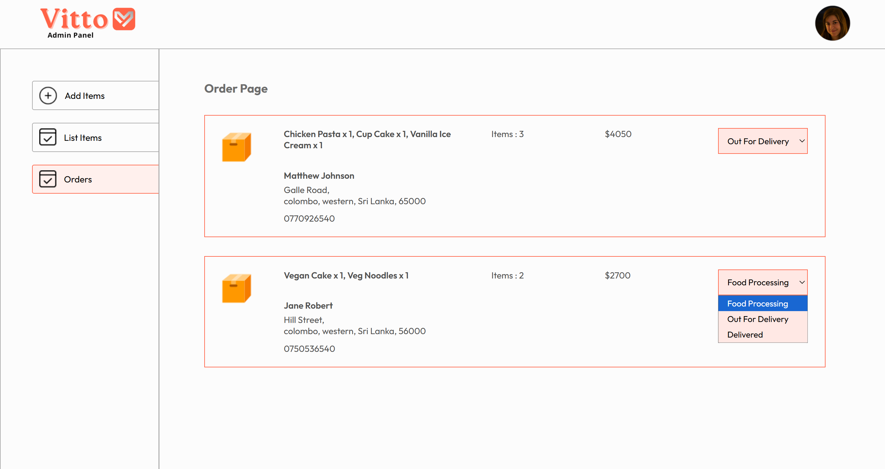

# 🍔 Vitto - Food Delivery Application

A modern full-stack food delivery platform built with the MERN stack, allowing users to browse food items, place online orders, make secure payments through Stripe, and track their orders, while providing an admin dashboard for managing food items and customer orders.

## 🛠️ Tech Stack

- ⚛️ React.js
- 🟢 Node.js
- 🚂 Express.js
- 🍃 MongoDB
- 💳 Stripe
- 🎨 CSS

## ✨ Features

- User authentication
- Browse food menu
- Shopping cart management
- Online food ordering
- Delivery information management
- Secure Stripe payment integration
- Order tracking
- My Orders
- Admin dashboard
- Food management (CRUD)
- Order management
- Delivery status updates
- Responsive user interface

## 📸 Screenshots

### 🏠 Home Page

### 🍽️ Menu

### 🛒 Cart

### 🚚 Delivery Information

### 💳 Stripe Payment

### 📦 My Orders

### 👨‍💼 Admin Dashboard

### 🍔 Food List (Admin)

### 📋 Orders Management

